# JavaScript Async JavaScript — Web API, Callback Queue & Event Loop

## JavaScript Runtime Environment

```mermaid
flowchart LR

    %% =========================
    %% JS ENGINE
    %% =========================
    subgraph JS["JS Engine"]
        direction TB

        subgraph MEMORY["Memory Heap"]
        end

        subgraph STACK["CALL STACK"]
            GLOBAL["Global"]
            FN1["fn"]
            FN2["fn"]
            FN3["fn"]
        end
    end

    %% =========================
    %% WEB API
    %% =========================
    subgraph WEB["Web API"]
        direction TB

        subgraph DOM["DOM API"]
            TIMEOUT["Set timeout"]
            INTERVAL["Set interval"]
            FETCH["fetch()"]
            REGISTER["Register<br/>Callback"]
        end
    end

    %% =========================
    %% MICROTASK QUEUE
    %% =========================
    subgraph PROMISE["Promise / Microtask Queue"]
        CB1["CB"]
        CB2["CB"]
    end

    %% =========================
    %% TASK QUEUE
    %% =========================
    subgraph TASK["Task Queue"]
        TCB1["CB"]
        TCB2["CB"]
    end

    %% =========================
    %% EVENT LOOP
    %% =========================
    EVENT["Event Loop"]

    %% =========================
    %% FLOW
    %% =========================

    FN1 -->|"Call"| TIMEOUT

    TIMEOUT -.-> REGISTER
    INTERVAL -.-> REGISTER

    FETCH -->|"Promise"| CB1

    REGISTER -.-> TCB1

    PROMISE -.->|"High Priority"| STACK

    TASK -.-> EVENT

    EVENT -.->|"Add to CALL Stack"| STACK


    %% =========================
    %% STYLING
    %% =========================

    style JS fill:#292929,stroke:#e6d84a,stroke-width:2px
    style WEB fill:#292929,stroke:#39ff14,stroke-width:2px
    style PROMISE fill:#292929,stroke:#ff00aa,stroke-width:2px
    style TASK fill:#292929,stroke:#ffffff,stroke-width:2px

    style FETCH fill:#292929,stroke:#ff00aa,stroke-width:2px
    style CB1 fill:#292929,stroke:#ff00aa,stroke-width:2px
    style CB2 fill:#292929,stroke:#ff00aa,stroke-width:2px

    style TIMEOUT fill:#292929,stroke:#39ff14,stroke-width:1px
    style INTERVAL fill:#292929,stroke:#39ff14,stroke-width:1px
    style REGISTER fill:#292929,stroke:#39ff14,stroke-width:2px

    style EVENT fill:#292929,stroke:#e6d84a,stroke-width:2px
```



---

# Components

## 1. JavaScript Engine

The **JavaScript Engine** executes JavaScript code.

It mainly contains:

- **Memory Heap**
- **Call Stack**

```text
JavaScript Engine
│
├── Memory Heap
│
└── Call Stack
```

---

## 2. Memory Heap

The **Memory Heap** is the area where JavaScript stores objects and other data in memory.

Example:

```javascript
const user = {
    name: "Ram",
    age: 22
};
```

The `user` object is stored in memory.

```text
Memory Heap
┌─────────────────┐
│   user object   │
│   name: "Ram"   │
│   age: 22       │
└─────────────────┘
```

---

# 3. Call Stack

The **Call Stack** keeps track of the functions that are currently being executed.

Example:

```javascript
function one() {
    two();
}

function two() {
    three();
}

function three() {
    console.log("Hello");
}

one();
```

Execution:

```text
CALL STACK

┌──────────────┐
│    three()   │  ← executing
├──────────────┤
│     two()    │
├──────────────┤
│     one()    │
├──────────────┤
│    Global    │
└──────────────┘
```

The Call Stack follows:

```text
LIFO

Last In
First Out
```

---

# 4. Web API

The **Web API** is provided by the browser environment.

Examples:

```javascript
setTimeout()
setInterval()
fetch()
DOM APIs
addEventListener()
```

These are **not directly provided by the JavaScript language itself**.

The browser provides these APIs to JavaScript.

```text
JavaScript
    │
    │ Call
    ▼
Web API
```

---

# 5. setTimeout()

Example:

```javascript
setTimeout(function () {
    console.log("Hello");
}, 2000);
```

What happens?

```text
JavaScript
    │
    ▼
Call Stack
    │
    │ setTimeout()
    ▼
Web API
    │
    │ waits 2 seconds
    ▼
Callback
    │
    ▼
Task Queue
```

The callback does **not immediately go back to the Call Stack**.

It first waits in the queue.

---

# 6. setInterval()

Example:

```javascript
setInterval(function () {
    console.log("Hello");
}, 1000);
```

The browser's Web API handles the timer.

After the interval completes, the callback can be placed into the appropriate task queue.

```text
Call Stack
     │
     ▼
Web API
     │
     │ setInterval()
     ▼
Callback
     │
     ▼
Task Queue
```

---

# 7. fetch()

Example:

```javascript
fetch("https://example.com")
    .then(function (response) {
        console.log(response);
    });
```

`fetch()` is handled by the browser's Web API.

The result is associated with a **Promise**.

```text
Call Stack
     │
     ▼
Web API
     │
     │ fetch()
     ▼
Promise
     │
     ▼
Microtask Queue
```

---

# 8. Callback

A **callback** is a function that is passed to another function and executed later.

Example:

```javascript
setTimeout(function () {
    console.log("Hello");
}, 2000);
```

Here:

```javascript
function () {
    console.log("Hello");
}
```

is the callback.

---

# 9. Task Queue

The **Task Queue** stores callbacks that are ready to be executed.

Example:

```javascript
setTimeout(() => {
    console.log("Hello");
}, 0);
```

Even with `0` milliseconds, the callback does not execute immediately.

It goes through:

```text
Call Stack
     │
     ▼
Web API
     │
     ▼
Task Queue
     │
     ▼
Event Loop
     │
     ▼
Call Stack
```

---

# 10. Promise / Microtask Queue

Promises use the **Microtask Queue**.

Example:

```javascript
Promise.resolve().then(() => {
    console.log("Promise");
});
```

The callback associated with `.then()` goes into the **Microtask Queue**.

```text
Promise
   │
   ▼
Microtask Queue
```

---

# 11. Microtask Queue Has Higher Priority

The Microtask Queue has priority over the normal Task Queue.

Conceptually:

```text
             Event Loop
                 │
                 ▼
        ┌─────────────────┐
        │ Microtask Queue │
        │   HIGH PRIORITY │
        └────────┬────────┘
                 │
                 ▼
             Call Stack
                 ▲
                 │
        ┌────────┴────────┐
        │    Task Queue   │
        │   Callbacks     │
        └─────────────────┘
```

For example:

```javascript
console.log("A");

setTimeout(() => {
    console.log("B");
}, 0);

Promise.resolve().then(() => {
    console.log("C");
});

console.log("D");
```

Output:

```text
A
D
C
B
```

Why?

```text
A
│
▼
Call Stack

D
│
▼
Call Stack

C
│
▼
Microtask Queue
│
│ HIGH PRIORITY
▼
Call Stack

B
│
▼
Task Queue
│
▼
Call Stack
```

Therefore:

```text
Synchronous Code
       ↓
Microtasks / Promises
       ↓
Tasks / Callbacks
```

---

# 12. Event Loop

The **Event Loop** continuously checks whether JavaScript can execute something from the queues.

Simplified flow:

```text
             ┌───────────────┐
             │  CALL STACK   │
             └───────┬───────┘
                     │
                     ▼
                 Web APIs
              ┌──────┴──────┐
              │             │
              ▼             ▼
        Microtask Queue   Task Queue
              │             │
              │             │
              └──────┬──────┘
                     ▼
                 EVENT LOOP
                     │
                     ▼
                CALL STACK
```

The Event Loop helps coordinate:

```text
Call Stack
    ↕
Queues
    ↕
Web APIs
```

---

# Complete Flow

```text
                    JavaScript Engine
                  ┌───────────────────┐
                  │                   │
                  │   Memory Heap     │
                  │                   │
                  │   CALL STACK      │
                  │   ┌────────────┐  │
                  │   │    fn      │  │
                  │   │    fn      │  │
                  │   │   Global   │  │
                  │   └────────────┘  │
                  └─────────┬─────────┘
                            │
                            │ Call
                            ▼
                    ┌─────────────────┐
                    │     Web API     │
                    │                 │
                    │ setTimeout()    │
                    │ setInterval()   │
                    │ fetch()         │
                    │ DOM API         │
                    └───────┬─────────┘
                            │
                  ┌─────────┴──────────┐
                  │                    │
                  ▼                    ▼
          ┌───────────────┐     ┌──────────────┐
          │   Promise /   │     │  Callback    │
          │ Microtask     │     │  Task Queue  │
          │ Queue         │     │              │
          │               │     │     CB       │
          │      CB       │     │     CB       │
          └───────┬───────┘     └──────┬───────┘
                  │                    │
                  │ HIGH PRIORITY      │
                  └────────┬───────────┘
                           ▼
                      EVENT LOOP
                           │
                           │ Add to
                           │ CALL STACK
                           ▼
                     ┌────────────┐
                     │ CALL STACK │
                     └────────────┘
```

---

# Important Example

```javascript
console.log("Start");

setTimeout(() => {
    console.log("Timeout");
}, 0);

Promise.resolve().then(() => {
    console.log("Promise");
});

console.log("End");
```

### Step-by-step

### Step 1 — `console.log("Start")`

It is synchronous.

```text
Call Stack
    │
    ▼
Start
```

Output:

```text
Start
```

---

### Step 2 — `setTimeout()`

The timer is handled by the Web API.

```text
Call Stack
    │
    ▼
Web API
    │
    ▼
Task Queue
```

---

### Step 3 — Promise

The Promise callback goes into the Microtask Queue.

```text
Promise
   │
   ▼
Microtask Queue
```

---

### Step 4 — `console.log("End")`

This is synchronous, so it executes immediately.

Output:

```text
Start
End
```

---

### Step 5 — Microtask Queue

The Promise callback has higher priority.

Output:

```text
Promise
```

---

### Step 6 — Task Queue

Now the `setTimeout()` callback executes.

Output:

```text
Timeout
```

### Final Output

```text
Start
End
Promise
Timeout
```

---

# One-Line Rule to Remember

```text
Synchronous Code
       ↓
Call Stack
       ↓
Web APIs handle async operations
       ↓
┌─────────────────────────────┐
│ Microtask Queue             │ ← Promise (.then, catch, finally)
│ HIGH PRIORITY               │
└──────────────┬──────────────┘
               ↓
        Event Loop
               ↓
┌─────────────────────────────┐
│ Task Queue                  │ ← setTimeout, events, etc.
└──────────────┬──────────────┘
               ↓
          Call Stack
```

## Key Points

- **Call Stack** → executes JavaScript code.
- **Memory Heap** → stores objects/data.
- **Web API** → browser-provided APIs such as `setTimeout()`, `fetch()`, and DOM APIs.
- **Callback** → function executed later.
- **Task Queue** → holds callbacks/tasks waiting to execute.
- **Microtask Queue** → handles Promise callbacks and has higher priority.
- **Event Loop** → coordinates when queued work can move to the Call Stack.
- JavaScript itself is **single-threaded**, but the browser environment provides mechanisms that allow asynchronous operations.