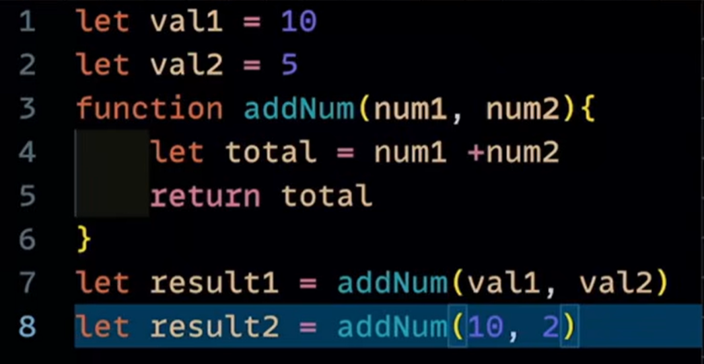

JavaScript Execution context
1. {} -> global Execution context always present
2. function execution context
3. Eval execution context

Memory creation phase or creation phase  -> variable are allocated memory allocated
execution phase -> all hte operations perform

.jpeg>)
.jpeg>)