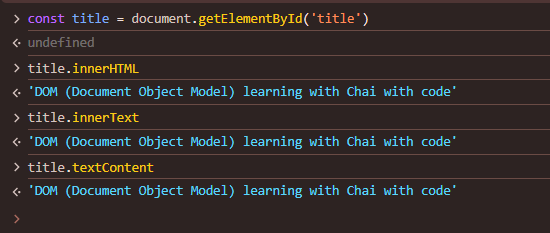
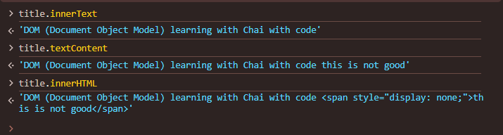

always we acces the webpage by documnet
like
document.getElementById('title').id;       // return title id name

document.getElementById('title').className;     // return heading class name

into these images given uses of getAttribute and setAttribute

setting new thing like tag not exit before into the heading but here it is there

into this image we see we add any thing of name tag like into this is just make this
document.getElementById('title').setAttribute('toggle', 'vimbar')

into this we setup the style how we use it into dom to access the

title.innerHTML
'DOM (Document Object Model) learning with Chai with code'
title.innerText
'DOM (Document Object Model) learning with Chai with code'
title.textContent
'DOM (Document Object Model) learning with Chai with code'

after changing
title.innerText
'DOM (Document Object Model) learning with Chai with code this is not good'
title.textContent
'DOM (Document Object Model) learning with Chai with code this is not good'
title.innerHTML
'DOM (Document Object Model) learning with Chai with code this is not good'

after changing
title.innerText
'DOM (Document Object Model) learning with Chai with code'
title.textContent
'DOM (Document Object Model) learning with Chai with code this is not good'
title.innerHTML
'DOM (Document Object Model) learning with Chai with code this is not good'

document.querySelectorAll('h2')[0]
<h2>​This is not a good sign​</h2>​
document.querySelectorAll('h2')[2]
<h2>This is not a good villain</h2>

document.querySelector('#title')
<h1 id=​"title" class=​"heading">​…​</h1>​
document.querySelector('.heading')
<h1 id=​"title" class=​"heading">​…​</h1>​

document.querySelector('input')
<input type=​"password" name=​"pass" id=​"pass">​

document.querySelector('input[type="password"]')
<input type=​"password" name id>​

const myul = document.querySelector('ul')
undefined
const firt = myul.querySelector('li')
undefined
const first = myul.querySelector('li')
undefined
const firstLi = first.style.background = "Blue"
undefined
const firstLi = first.style.background = "Green"
undefined
const second = myul.querySelectorAll('li')[1]
undefined
const secondLi = second.sty
undefined
const secondLi = second.style.background = "Blue"
undefined

const tempLiList = document.querySelectorAll('li')
undefined
tempLiList
NodeList(3) [li, li, li]
0: li
1: li
2: li
length: 3
[[Prototype]]: NodeList
entries: ƒ entries()
forEach: ƒ forEach()
item: ƒ item()
keys: ƒ keys()
length: (...)
values: ƒ values()
constructor: ƒ NodeList()
Symbol(Symbol.iterator): ƒ values()
Symbol(Symbol.toStringTag): "NodeList"
get length: ƒ length()
[[Prototype]]: Object

so map is not present it means it is not providing me array it is giving me list node

const tempLiList = document.querySelectorAll('li')
undefined
tempLiList[0].style.color = "Pink"
'Pink'
tempLiList[0].style.color = "Yellow"
'Yellow'
tempLiList[0].style.size = "20px"
'20px'
tempLiList[0].style.fontSizeAdjust = "20px"
'20px'
tempLiList[0].style.fontSize = "20px"
'20px'
tempLiList[0].style.fontSize = "50px"
'50px'
tempLiList[0].style.fontSize = "30px"
'30px'

const tempLiList = document.querySelectorAll('li')
undefined
tempLiList[0].style.fontSize = "30px"
'30px'
tempLiList[0].style.color = "Yellow"
'Yellow'
tempLiList.forEach( function (l) {
    l.style.background = "Green"
})
undefined

document.getElementsByClassName('list-item')
HTMLCollection(4) [li.list-item, li.list-item, li.list-item, li.list-item]
0: li.list-item
1: li.list-item
2: li.list-item
3: li.list-item
length: 4
[[Prototype]]: HTMLCollection
item: ƒ item()
length: (...)
namedItem: ƒ namedItem()
constructor: ƒ HTMLCollection()
Symbol(Symbol.iterator): ƒ values()
Symbol(Symbol.toStringTag): "HTMLCollection"
get length: ƒ length()
[[Prototype]]: Object

see into this it return HTML document not node or array so we convert it into array
const convertedIntoArray = Array.from(document.getElementsByClassName('list-item'))
undefined
convertedIntoArray
(4) [li.list-item, li.list-item, li.list-item, li.list-item]
0: li.list-item
1: li.list-item
2: li.list-item
3: li.list-item
length: 4
[[Prototype]]: Array(0)
at: ƒ at()
concat: ƒ concat()
constructor: ƒ Array()
copyWithin: ƒ copyWithin()
entries: ƒ entries()
every: ƒ every()
fill: ƒ fill()
filter: ƒ filter()
find: ƒ find()
findIndex: ƒ findIndex()
findLast: ƒ findLast()
findLastIndex: ƒ findLastIndex()
flat: ƒ flat()
flatMap: ƒ flatMap()
forEach: ƒ forEach()
includes: ƒ includes()
indexOf: ƒ indexOf()
join: ƒ join()
keys: ƒ keys()
lastIndexOf: ƒ lastIndexOf()
length: 0
map: ƒ map()
pop: ƒ pop()
push: ƒ push()
reduce: ƒ reduce()
reduceRight: ƒ reduceRight()
reverse: ƒ reverse()
shift: ƒ shift()
slice: ƒ slice()
some: ƒ some()
sort: ƒ sort()
splice: ƒ splice()
toLocaleString: ƒ toLocaleString()
toReversed: ƒ toReversed()
toSorted: ƒ toSorted()
toSpliced: ƒ toSpliced()
toString: ƒ toString()
unshift: ƒ unshift()
values: ƒ values()
with: ƒ with()
Symbol(Symbol.iterator): ƒ values()
Symbol(Symbol.unscopables): {at: true, copyWithin: true, entries: true, fill: true, find: true, …}
[[Prototype]]: Object

const convertedIntoArray = Array.from(document.getElementsByClassName('list-item'))
undefined
convertedIntoArray
(4) [li.list-item, li.list-item, li.list-item, li.list-item]
convertedIntoArray.forEach(function (list) {
    list.style.background = "Pink"
})
undefined
convertedIntoArray.forEach(function (list) {
    list.style.color = "Blue"
})
undefined

document.getElementById('h2')
null
document.querySelectorAll('h2')
NodeList(15) [h2.vector-pinnable-header-label, h2#History, h2#Trademark, h2#Website_client-side_usage, h2#Other_usage, h2#Execution, h2#Features, h2#Syntax, h2#Security, h2#Development_tools, h2#Related_technologies, h2#Notes, h2#References, h2#Further_reading, h2#External_links]
document.querySelectorAll('h2')[2].style.padding = "300px"
'300px'
document.querySelectorAll('h2')[2].style.padding = "none"
'none'
document.querySelectorAll('h2')[2].style.padding = "0px"
'0px'
const h2List = document.querySelectorAll('h2')
undefined
h2List.forEach( function (allItems) {
    allItems.style.color = "Red";
})
undefined
h2List.forEach( function (allItems) {
    allItems.style.color = "Red";
    allItems.style.backGround = "Pink";
    allItems.style.margin = "Center";
})
undefined
h2List.forEach( function (allItems) {
    allItems.style.color = "Red";
    allItems.style.backGround = "Pink";
    allItems.style.margin = "100px";
})
undefined
h2List.forEach( function (allItems) {
    allItems.style.color = "Red";
    allItems.style.backGround = "Pink";
    allItems.style.margin = "100px";
    allItems.innerText = "Hello Dosto"
})
undefined
